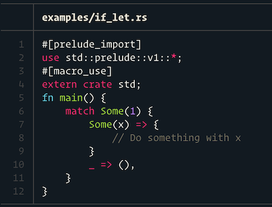

# cargo inspect 

What is Rust doing behind the scenes?

> There are only two ways to live your life.  
> One is as though nothing is a miracle. 
> The other is as though everything is a miracle. -- Albert Einstein

## Installation

You need Rust nightly and `rustfmt` to get started.  
You can install those via [rustup]:

```
rustup install nightly
rustup component add rustfmt-preview
```

All set? Let's get cracking!

```
cargo install cargo-inspect
```

## Usage

Call it on any Rust file:

```
cargo inspect main.rs
```

## Configuration 

```
USAGE:
    cargo inspect [OPTIONS] <INPUT_FILE>

FLAGS:
    -h, --help       Prints help information
    -V, --version    Prints version information

OPTIONS:
        --theme <theme>          Theme for syntax highlighting. See syntex documentation for options [default: base16-
                                 ocean.dark]
        --unpretty <unpretty>    rustc "unpretty" parameters [default: hir]

ARGS:
    <INPUT_FILE>    Input file
```

## Background

Rust allows for a lot of syntactic sugar, that makes it a pleasure to write.
It is sometimes hard, however, to look behind the curtain and see what the compiler is really doing with our code.

To quote @tshepang, 
"It is good to know what these conveniences are, to avoid being mystified by what's going on under the hood... the less magical thinking we have of the world, the better."

* lifetime elisions
* type inference
* syntactic sugar
* implicit dereferencing
* type coercions
* hidden code (e.g. the prelude)

I was always interested in how programming languages work in the background,
how my code was unrolled to the compiler backend easier to maintain.

The goal is to make the compiler more approachable for mere-mortals.  
Mystery! Exploration! Discovery! 


## Code Examples

### `If-let` gets desugared into `match`

Consider the following code snippet:

```rust
fn main() {
    if let Some(x) = Some(1) {
        // Do something with x
    }
}
```

When you compile it, the first thing Rust does is desugar it. To see what the code looks like after this step, run

```
cargo inspect examples/if_let.rs
```

This produces the following output:



You can see that the `if let` was desugared into a `match` statement.

### More examples

Please find more examples in the `examples` folder. You can also contribute more.

## The Magic Sauce

The best things in the world are assembled from simple building blocks.
This tool stands on the shoulders of giants.
To work its magic, it runs the following commands:

1. `rustc -Zinspect=hir`, for retrieving the HIR.
2. `rustfmt`, for formatting the output.
3. [`prettyprint`](https://github.com/mre/prettyprint), for syntax-highlighting, which is just a wrapper around the awesome [syntect](https://github.com/trishume/syntect/blob/master/examples/syncat.rs) and [bat](https://github.com/sharkdp/bat/) crates.

## Contributing

This is a young project, which has downsides and upsides.

* Everything is in flux and things can break at any time. 😫
* There's plenty of opportunity to shape and form the project. 😊

Thus, become a contributor today!

## Known issues

As of now, this is a very fragile tool. If it fails, it ~~might~~ will produce
horrible output. You have been warned. That said, it won't eat your code, of course. :blush:

## License

Licensed under either of

* Apache License, Version 2.0, (LICENSE-APACHE or http://www.apache.org/licenses/LICENSE-2.0)
* MIT license (LICENSE-MIT or http://opensource.org/licenses/MIT)

at your option.

[rustup]: https://rustup.rs/